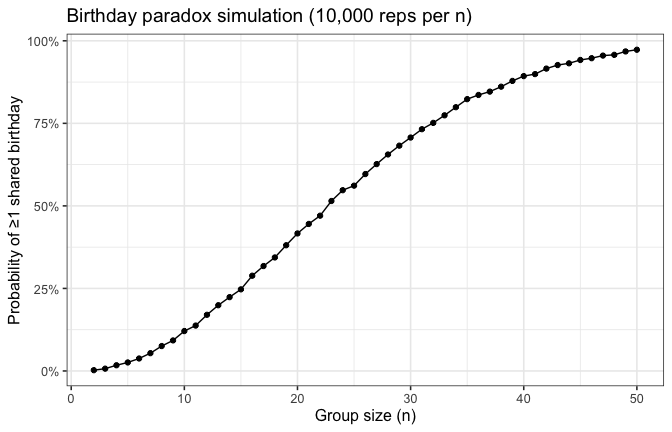
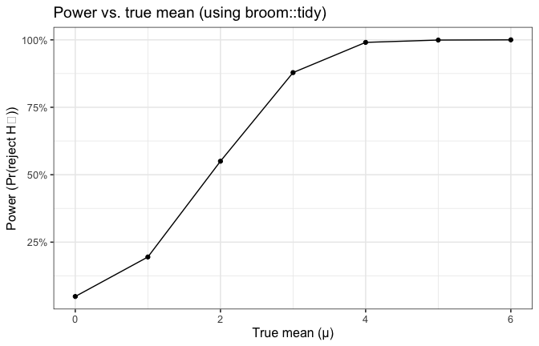
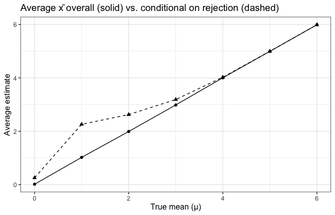
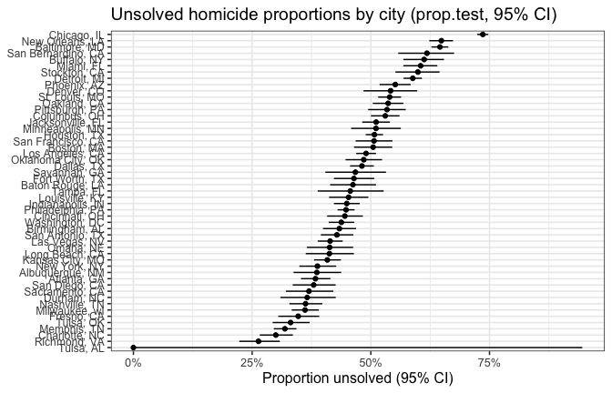

p8105_hw5_fx2206
================
Fei Xue
2025-11-13

``` r
knitr::opts_chunk$set(echo = TRUE, message = FALSE, warning = FALSE, fig.width = 7, fig.height = 4.5)
library(tidyverse)
```

    ## ── Attaching core tidyverse packages ──────────────────────── tidyverse 2.0.0 ──
    ## ✔ dplyr     1.1.4     ✔ readr     2.1.5
    ## ✔ forcats   1.0.0     ✔ stringr   1.5.1
    ## ✔ ggplot2   3.5.2     ✔ tibble    3.3.0
    ## ✔ lubridate 1.9.4     ✔ tidyr     1.3.1
    ## ✔ purrr     1.1.0     
    ## ── Conflicts ────────────────────────────────────────── tidyverse_conflicts() ──
    ## ✖ dplyr::filter() masks stats::filter()
    ## ✖ dplyr::lag()    masks stats::lag()
    ## ℹ Use the conflicted package (<http://conflicted.r-lib.org/>) to force all conflicts to become errors

``` r
library(broom)
library(purrr)
library(readr)
library(stringr)

set.seed(8105)
theme_set(theme_bw(base_size = 12))
```

``` r
has_dup_bday <- function(n, days_in_year = 365) {
bdays <- sample.int(days_in_year, size = n, replace = TRUE)
any(duplicated(bdays))
}
```

``` r
n_grid <- 2:50
n_sims <- 10000

p1_res <- map_df(n_grid, ~{tibble(n = .x, dup = replicate(n_sims, has_dup_bday(.x)))}) |>
group_by(n) |>
summarise(prob_shared = mean(dup), .groups = "drop")

p1_res |> head()
```

    ## # A tibble: 6 × 2
    ##       n prob_shared
    ##   <int>       <dbl>
    ## 1     2      0.0024
    ## 2     3      0.007 
    ## 3     4      0.0173
    ## 4     5      0.0258
    ## 5     6      0.0378
    ## 6     7      0.0539

``` r
ggplot(p1_res, aes(n, prob_shared)) +
geom_line() +
geom_point() +
scale_y_continuous(labels = scales::percent_format(accuracy = 1)) +
labs(
x = "Group size (n)",
y = "Probability of ≥1 shared birthday",
title = "Birthday paradox simulation (10,000 reps per n)"
)
```

<!-- --> The
plot shows how the probability that at least two people in a group share
the same birthday increases as group size n grows. When n is small, the
probability of a shared birthday is very low. However, it rises rapidly
after n ≈ 15, crossing 50% around n = 23. By n ≈ 40, the probability
exceeds 90%, and by n = 50, it is nearly 100%.

**Problem 2**

``` r
set.seed(8105)
n <- 30
sigma <- 5
mus <- 0:6
B <- 5000

simulate_once <- function(mu, n = 30, sigma = 5) {
  x <- rnorm(n, mean = mu, sd = sigma)
  tt <- t.test(x, mu = 0)
  tidy(tt) |>
    mutate(mu_true = mu) |>
    select(mu_true, estimate, p.value) |>
    rename(xbar = estimate, p = p.value)
}

p2_res <- map_dfr(mus, function(mu) {
  reps <- replicate(B, simulate_once(mu, n, sigma), simplify = FALSE)
  bind_rows(reps)
})

p2_res %>% count(mu_true)
```

    ## # A tibble: 7 × 2
    ##   mu_true     n
    ##     <int> <int>
    ## 1       0  5000
    ## 2       1  5000
    ## 3       2  5000
    ## 4       3  5000
    ## 5       4  5000
    ## 6       5  5000
    ## 7       6  5000

calculate and draw power graph

``` r
p2_power <-
  p2_res %>%
  group_by(mu_true) %>%
  summarise(power = mean(p < 0.05), .groups = "drop")

ggplot(p2_power, aes(x = mu_true, y = power)) +
  geom_point() +
  geom_line() +
  scale_y_continuous(labels = scales::percent_format(accuracy = 1)) +
  labs(
    x = "True mean (μ)",
    y = "Power (Pr(reject H₀))",
    title = "Power vs. true mean (using broom::tidy)"
  )
```

<!-- -->
Power increases monotonically with the effect size (the farther μ is
from 0, the more likely we reject the false null).

``` r
p2_means_overall <-
  p2_res %>%
  group_by(mu_true) %>%
  summarise(avg_xbar = mean(xbar), .groups = "drop")

p2_means_reject <-
  p2_res %>%
  filter(p < 0.05) %>%
  group_by(mu_true) %>%
  summarise(avg_xbar_reject = mean(xbar), .groups = "drop")

p2_means <- left_join(p2_means_overall, p2_means_reject, by = "mu_true")

ggplot(p2_means, aes(mu_true, avg_xbar)) +
  geom_point() +
  geom_line() +
  geom_point(aes(y = avg_xbar_reject), shape = 17, size = 2) +
  geom_line(aes(y = avg_xbar_reject), linetype = 2) +
  labs(
    x = "True mean (μ)",
    y = "Average estimate",
    title = "Average x̄ overall (solid) vs. conditional on rejection (dashed)"
  )
```

<!-- --> The
overall sample average of μ across all simulations is approximately
equal to the true value of μ, as shown by the solid line lying nearly on
the 45-degree reference. This indicates that the estimator μ is unbiased
for all values of μ. However, the average μ conditional on rejecting the
null hypothesis (the dashed line) is larger than the true μ when the
true mean is small (e.g., μ = 0–3). This occurs because we only keep
samples that happen to produce large estimated means that pass the
significance threshold (p \< 0.05). In other words, this is a form of
selection bias — significant results tend to overestimate the true
effect size. When the true μ is large (e.g., ≥ 4), power is near 100%,
so nearly all samples reject the null, and the conditional average
aligns again with the true mean.

**Problem 3**

``` r
homs_raw <- read_csv("homicide-data.csv", show_col_types = FALSE)
glimpse(homs_raw)
```

    ## Rows: 52,179
    ## Columns: 12
    ## $ uid           <chr> "Alb-000001", "Alb-000002", "Alb-000003", "Alb-000004", …
    ## $ reported_date <dbl> 20100504, 20100216, 20100601, 20100101, 20100102, 201001…
    ## $ victim_last   <chr> "GARCIA", "MONTOYA", "SATTERFIELD", "MENDIOLA", "MULA", …
    ## $ victim_first  <chr> "JUAN", "CAMERON", "VIVIANA", "CARLOS", "VIVIAN", "GERAL…
    ## $ victim_race   <chr> "Hispanic", "Hispanic", "White", "Hispanic", "White", "W…
    ## $ victim_age    <chr> "78", "17", "15", "32", "72", "91", "52", "52", "56", "4…
    ## $ victim_sex    <chr> "Male", "Male", "Female", "Male", "Female", "Female", "M…
    ## $ city          <chr> "Albuquerque", "Albuquerque", "Albuquerque", "Albuquerqu…
    ## $ state         <chr> "NM", "NM", "NM", "NM", "NM", "NM", "NM", "NM", "NM", "N…
    ## $ lat           <dbl> 35.09579, 35.05681, 35.08609, 35.07849, 35.13036, 35.151…
    ## $ lon           <dbl> -106.5386, -106.7153, -106.6956, -106.5561, -106.5810, -…
    ## $ disposition   <chr> "Closed without arrest", "Closed by arrest", "Closed wit…

The Washington Post homicide dataset contains records of individual
homicide cases from 50 large U.S. cities, including information such as
victim demographics, location, and case disposition (e.g., “Closed by
arrest,” “Closed without arrest,” “Open/No arrest”). (1)

``` r
homs <-
  homs_raw |>
  mutate(
    city_state = str_c(city, ", ", state),
    unsolved = disposition %in% c("Closed without arrest", "Open/No arrest")
  )

city_summ <-
  homs |>
  group_by(city_state) |>
  summarise(
    total = n(),
    unsolved = sum(unsolved, na.rm = TRUE),
    .groups = "drop"
  ) |>
  arrange(desc(total))

city_summ |> slice_head(n = 10)
```

    ## # A tibble: 10 × 3
    ##    city_state       total unsolved
    ##    <chr>            <int>    <int>
    ##  1 Chicago, IL       5535     4073
    ##  2 Philadelphia, PA  3037     1360
    ##  3 Houston, TX       2942     1493
    ##  4 Baltimore, MD     2827     1825
    ##  5 Detroit, MI       2519     1482
    ##  6 Los Angeles, CA   2257     1106
    ##  7 St. Louis, MO     1677      905
    ##  8 Dallas, TX        1567      754
    ##  9 Memphis, TN       1514      483
    ## 10 New Orleans, LA   1434      930

2)  

``` r
balt <- city_summ |> filter(city_state == "Baltimore, MD")
balt_pt <- prop.test(x = balt$unsolved, n = balt$total)

balt_tidy <- tidy(balt_pt) |>
  transmute(
    city_state = "Baltimore, MD",
    prop_unsolved = estimate,
    conf_low = conf.low,
    conf_high = conf.high
  )

balt_tidy
```

    ## # A tibble: 1 × 4
    ##   city_state    prop_unsolved conf_low conf_high
    ##   <chr>                 <dbl>    <dbl>     <dbl>
    ## 1 Baltimore, MD         0.646    0.628     0.663

3)  

``` r
city_props <-
  city_summ |>
  mutate(
    pt = map2(unsolved, total, ~prop.test(.x, .y)),
    pt_tidy = map(pt, ~tidy(.x))
  ) |>
  select(city_state, pt_tidy) |>
  unnest(pt_tidy) |>
  transmute(
    city_state,
    prop_unsolved = estimate,
    conf_low = conf.low,
    conf_high = conf.high
  )
city_props |> arrange(desc(prop_unsolved)) |> slice_head(n = 5)
```

    ## # A tibble: 5 × 4
    ##   city_state         prop_unsolved conf_low conf_high
    ##   <chr>                      <dbl>    <dbl>     <dbl>
    ## 1 Chicago, IL                0.736    0.724     0.747
    ## 2 New Orleans, LA            0.649    0.623     0.673
    ## 3 Baltimore, MD              0.646    0.628     0.663
    ## 4 San Bernardino, CA         0.618    0.558     0.675
    ## 5 Buffalo, NY                0.612    0.569     0.654

4)  

``` r
city_props_plot <-
  city_props |>
  mutate(city_state = fct_reorder(city_state, prop_unsolved))

ggplot(city_props_plot, aes(x = prop_unsolved, y = city_state)) +
  geom_point() +
  geom_errorbarh(aes(xmin = conf_low, xmax = conf_high), height = 0) +
  scale_x_continuous(labels = scales::percent_format(accuracy = 1)) +
  labs(
    x = "Proportion unsolved (95% CI)",
    y = NULL,
    title = "Unsolved homicide proportions by city (prop.test, 95% CI)"
  ) +
  theme(axis.text.y = element_text(size = 9))
```

<!-- -->
